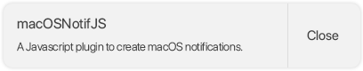

# macOSNotifJS
\
**A simple Javascript plugin to create simulated macOS notifications on your website.**

To use the package, copy the contents of the `dist` folder (except the html) and serve it on your website.

## Discussion, Support and Issues
For general support and discussion of this project, please join the Discord server: https://discord.gg/qyXqA7y \

To check known bugs and see planned changes and features for this project, please see the GitHub issues.\
Found a bug we don't already have an issue for? Please report it in a new GitHub issue with as much detail as you can!
